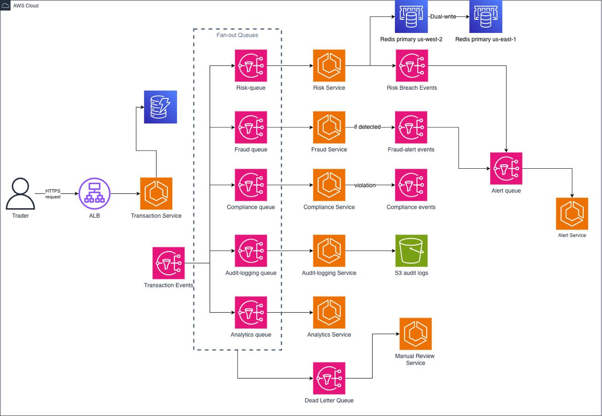

# Distributed Trading Risk Monitor

A real-time, event-driven microservices system that processes financial transactions, detects fraud, enforces risk limits, and validates regulatory compliance — all at scale on AWS.

Built as a team project for **CS 6650: Building Scalable Distributed Systems** (Spring 2026, Northeastern University).

## Why We Built This

Distributed systems concepts are easiest to understand when the stakes feel real. We wanted a system where:

- **Message ordering and priority actually matter** — a $500k trade shouldn't wait in line behind routine $20 purchases
- **Failures have visible consequences** — what happens to your fraud queue when the fraud service goes down for 7 minutes?
- **The CAP theorem isn't abstract** — you can flip a config flag and *measure* the latency cost of consistency vs. the correctness cost of availability

A trading risk pipeline fit all three. Every transaction fans out to fraud detection, risk assessment, and compliance checking in parallel. The system has to be fast enough to keep up with load, resilient enough to survive service failures, and observable enough to understand what's happening in real time.


## Architecture



**8 Go microservices**, all deployed on ECS Fargate, communicating through SNS/SQS fan-out. The dashboard is a React + FastAPI app that shows live queue depths, service health, and lets you inject failures or bulk-submit transactions interactively.


## Services

| Service | What it does |
|---|---|
| **Transaction** | HTTP entry point — validates, writes to DynamoDB, publishes to SNS with derived priority |
| **Fraud Detection** | Consumes high-priority queue — flags suspicious patterns (high-value, round amounts, large withdrawals) |
| **Risk Monitor** | Tracks daily spend per user in Redis — enforces configurable daily limits via atomic `INCRBYFLOAT` |
| **Compliance** | Validates against blocked users, currencies, merchant lists, and transaction type rules |
| **Analytics** | Publishes CloudWatch metrics for transaction volume reporting |
| **Audit Logging** | Batches transactions and uploads to S3 for historical record-keeping |
| **Alert** | Routes fraud/risk/compliance events by severity — logs and notifies on breach |
| **Manual Review** | DLQ consumer — catches anything that failed processing across all 5 DLQs for human triage |

Priority is derived automatically from amount: `$50k+` → critical, `$10k+` → high, `$1k+` → medium, otherwise low. High-priority messages are filtered to fraud/risk/compliance immediately; analytics and audit logging receive everything at lower urgency.


## Key Design Decisions

### Priority-Based Message Routing
SNS filter policies route high-priority transactions to fraud/risk/compliance services immediately, while analytics and audit logging receive a full but unfiltered stream. This means a critical trade never waits behind a batch analytics job.

### CAP Theorem in Practice
The Risk Monitor tracks daily spend in Redis. It exposes a configurable `REDIS_SYNC_MODE`:
- **`single`** — writes only to the primary Redis instance (CP: consistent within one region)
- **`local`** — each region has its own Redis, independent (AP: fast, but per-region limits only)
- **`dual-write`** — synchronous writes to primary (us-west-2) + replica (us-east-1) (CP: globally consistent, higher latency)

We ran load tests in all three modes and measured the latency and correctness tradeoffs directly.

### Atomic Risk Enforcement
The risk limit check uses Redis `INCRBYFLOAT` — a single atomic server-side operation. We also implemented a non-atomic `GET/SET` path to deliberately demonstrate the race condition: under concurrent load, multiple goroutines read the same stale value and all pass the $50k check simultaneously.

### Chaos Engineering
`chaos.sh` can kill fraud, risk, and compliance services while load tests are running. We used this to observe queue buildup, measure recovery time, and validate that auto-scaling responds correctly to depth spikes. The dashboard lets you do this interactively with one click.

### Auto-Scaling Tied to Queue Depth
Each ECS service scales based on its SQS queue depth, not CPU. This is more meaningful for async consumers — a service with an empty queue doesn't need more replicas even if something else is pegging CPU.

### Dead Letter Queue Fan-Out
All 5 DLQs (fraud, risk, compliance, analytics, audit-logging) are consumed by a single Manual Review service running parallel goroutines — one per queue. Failed messages are flagged in DynamoDB and an SNS alert is published for human triage.


## Infrastructure

All AWS resources are provisioned with Terraform, modularly organized:

| Module | Resources |
|---|---|
| `vpc/` | VPC, public/private subnets, NAT gateway, security groups |
| `ecs-cluster/` | ECS cluster, IAM roles, CloudWatch log groups |
| `ecs-services/` | 8 task definitions + services (256 CPU, 512MB memory each) |
| `sns/` | 4 SNS topics (transaction-events, fraud-alerts, risk-breach, compliance-events) |
| `sqs/` | 5 service queues + 1 alert queue + 5 DLQs with redrive policies |
| `dynamodb/` | Transactions table with 90-day TTL |
| `s3/` | Audit logs bucket |
| `redis/` | ElastiCache replication group, encrypted, multi-AZ (us-west-2) |
| `redis-replica/` | Secondary ElastiCache cluster in us-east-1 for CAP experiment |
| `alb/` | Application Load Balancer (HTTP ingress for transaction service) |
| `ecr/` | Per-service container registries (8 repositories) |
| `autoscaling/` | Target-tracking policies per service (SQS depth metric) |
| `cloudwatch-dashboard/` | Custom dashboard: queue depths, latency, error rates, service health |


## Dashboard

A live control panel for the system, built with React 18 + Vite + Tailwind CSS (frontend) and FastAPI (backend):

| Tab | What it shows |
|---|---|
| **Chaos Engineering** | Kill or restart any ECS service, inject artificial processing delays, monitor running/desired task counts and DLQ depths in real time |
| **Observability** | Transactions/min, total transactions, fraud flagged count, error rate, live queue depth chart (high/low/alert), transaction volume by type |
| **System Status** | Full architecture diagram + live ECS service health (running vs. desired) |
| **Transaction Explorer** | Browse DynamoDB records, filter by priority, type, or user ID |
| **Batch Upload** | Upload an Excel (.xlsx) or CSV file of transactions, preview before submission, stream progress via SSE, and export results — supports thousands of rows with a live progress bar and per-row status |

Backend polls AWS every 5 seconds. Queue depths aggregate across all per-service queues (fraud + risk + compliance = high priority; analytics + audit-logging = low priority).


## Experiments

Five experiments, each targeting a core distributed systems tradeoff. Full results are in `locust/results/`.

| # | Experiment | One-line summary |
|---|---|---|
| 1 | **Extreme Load — Breaking Point** | System handled 100–500 users cleanly but broke at 1,000 (11.7% failure rate, 95% were 502s from the transaction service — the only non-async bottleneck) |
| 2 | **Cascading Failure & Recovery** | Killed fraud, risk, and compliance mid-load — zero failures in 313,846 requests; queues buffered messages and drained automatically on restore |
| 3 | **Atomic vs Non-Atomic Risk Limits** | Atomic `INCRBYFLOAT` enforced the $50k limit to exactly 5 transactions; non-atomic GET/SET let 25+ through due to concurrent goroutines reading stale values simultaneously |
| 4 | **Data Integrity Audit** | Submitted 9,976 transactions via Locust and reconciled against DynamoDB, S3, and all DLQs — zero missing, zero duplicates, 100% match |
| 5 | **Cross-Region Redis — CAP Theorem** | Single-region (CP, 1,211ms avg), independent (AP, 1,142ms, no global limit), dual-write (CP, 1,021ms, global limit enforced) — dual-write was both fastest and most correct |


## Load Testing

Six Locust test profiles, run files in `locust/`, results in `locust/results/`:

| File | Experiment | Purpose |
|---|---|---|
| `locustfile.py` | General | 100 simulated traders, realistic value distribution (6:3:1 low:medium:high) |
| `staged_load.py` | Exp 1 | Progressive ramp 100→3,000 users across 5 stages to find throughput ceiling |
| `cascade_test.py` | Exp 2 | Baseline load → kill 3 services mid-test → restore → measure queue buildup and zero-failure isolation |
| `risk_test.py` | Exp 3 | High-concurrency load targeting a single user to trigger the atomic vs non-atomic race condition |
| `audit_test.py` | Exp 4 | 10,000 sequential transactions with CSV tracking for full DynamoDB/S3/DLQ reconciliation |
| `region_test.py` | Exp 5 | Parallel load against single / independent / dual-write Redis configs to compare latency and correctness |


## Deploy

```bash
./bootstrap.sh                        # one-time S3 + DynamoDB state setup
cd terraform && terraform apply       # provision all AWS infrastructure
./build-push.sh                       # build Docker images, push to ECR, redeploy ECS
```

## Running Locally

```bash
# Backend dashboard
cd dashboard/backend
source venv/bin/activate
ALB_URL=http://<ALB_DNS> uvicorn main:app --host 0.0.0.0 --port 8000 --reload

# Frontend dashboard
cd dashboard/frontend
npm run dev
# open http://localhost:5173

# End-to-end verification
python3 scripts/verify_system.py http://<ALB_DNS>

# Reconciliation after audit test (Experiment 4)
python3 scripts/reconcile.py

# Load tests
locust -f locust/locustfile.py         --host http://<ALB_DNS>
locust -f locust/staged_load.py        --host http://<ALB_DNS> --users 3000 --spawn-rate 50 --run-time 90m --headless
locust -f locust/cascade_test.py       --host http://<ALB_DNS> --users 100  --spawn-rate 10  --headless
locust -f locust/risk_test.py          --host http://<ALB_DNS> --users 100  --spawn-rate 100 --run-time 60s --headless
locust -f locust/audit_test.py         --host http://<ALB_DNS> --users 50   --spawn-rate 10  --headless
locust -f locust/region_test.py        --host http://<ALB_DNS> --users 50   --spawn-rate 10  --run-time 60s --headless
```


## How the Project Developed

We built this over four weeks across 26 pull requests. Here's how it came together:

### Week 1 — Foundations (March 24–25)
The first week was all infrastructure. We set up the repo structure, provisioned the core AWS resources with Terraform (VPC, SNS topics, SQS queues with DLQs), and got the Go project skeleton in place.

| PR | What landed |
|---|---|
| #1 | Initial repo setup and file structure |
| #2 | Core Terraform infrastructure |
| #3 | SNS topic, SQS queues, and DLQs |
| #5 | DynamoDB, S3, and Redis Terraform modules |
| #6 | Go project setup and shared JSON event types |
| #7 | Reusable SQS consumer library |

### Week 2 — Core Services (March 26–29)
With infrastructure in place, we built out all eight services in parallel across branches.

| PR | What landed |
|---|---|
| #8 | Go module setup for low-priority services |
| #10 | Analytics and Audit Logging services |
| #11 | Fraud Detection and Risk Monitor services |
| #12 | Transaction Service — HTTP entry point, SNS publish with priority routing |
| #13 | Service refinements and integration fixes |

By March 29, every service could receive messages and the end-to-end event flow worked locally.

### Week 3 — Observability & Compliance (April 9–12)
We wired up the parts that make the system *observable* and operationally complete.

| PR | What landed |
|---|---|
| #14 | Chaos Engineering Dashboard (React + FastAPI) |
| #15 | Compliance service — blocked users, currencies, transaction rules |
| #16 | ECS auto-scaling policies tied to SQS queue depth |
| #17 | DynamoDB integration — transaction status updates from fraud/risk |
| #18 | CloudWatch dashboard — queue depths, latency, service health metrics |
| #19 | Alert service (severity-based routing) and Manual Review DLQ fallback |

### Week 4 — Containerization & Experiments (April 14–18)
Final push: container everything, run the experiments, collect results.

| PR | What landed |
|---|---|
| #20 | Cleaned up unused services (recommendation service removed) |
| #21 | ECS task definitions for compliance, alert, and manual-review |
| #22 | Dockerfiles and auto-scaling for all 8 services |
| #23 | Load test scripts and results upload |
| #24 | Queue separation (high-priority vs. low-priority finalized) |
| #25 | Chaos scripts, staged load tests, CloudWatch dashboard updates |
| #26 | Final experiment results |


## Team

| Contributor | Role |
|---|---|
| **Vidit Gandhi** | SNS/SQS/DLQ setup · Analytics & Audit Logging services · Chaos Dashboard · DynamoDB integration · Dockerfiles · Auto-scaling scripts · Load tests |
| **Dhyan** | Go setup & shared types · SQS consumer library · Fraud Detection · Risk Monitor · Compliance service · Alert service · Manual Review · ECS task definitions · Queue separation · Final results |
| **Shloka Trivedi** | DynamoDB, S3, Redis Terraform modules · Go module setup for low-priority services · Transaction Service · ECS auto-scaling policies · CloudWatch dashboard |


## Tech Stack

| Layer | Technology |
|---|---|
| Services | Go 1.25 + aws-sdk-go-v2 |
| Cache | Redis 7 (go-redis) |
| Database | AWS DynamoDB |
| Messaging | AWS SNS + SQS |
| Containers | Docker + AWS ECR + ECS Fargate |
| Infrastructure | Terraform (AWS provider v5) |
| Dashboard backend | Python + FastAPI |
| Dashboard frontend | React 18 + Vite + Tailwind CSS |
| Load testing | Locust |
| Monitoring | AWS CloudWatch |
